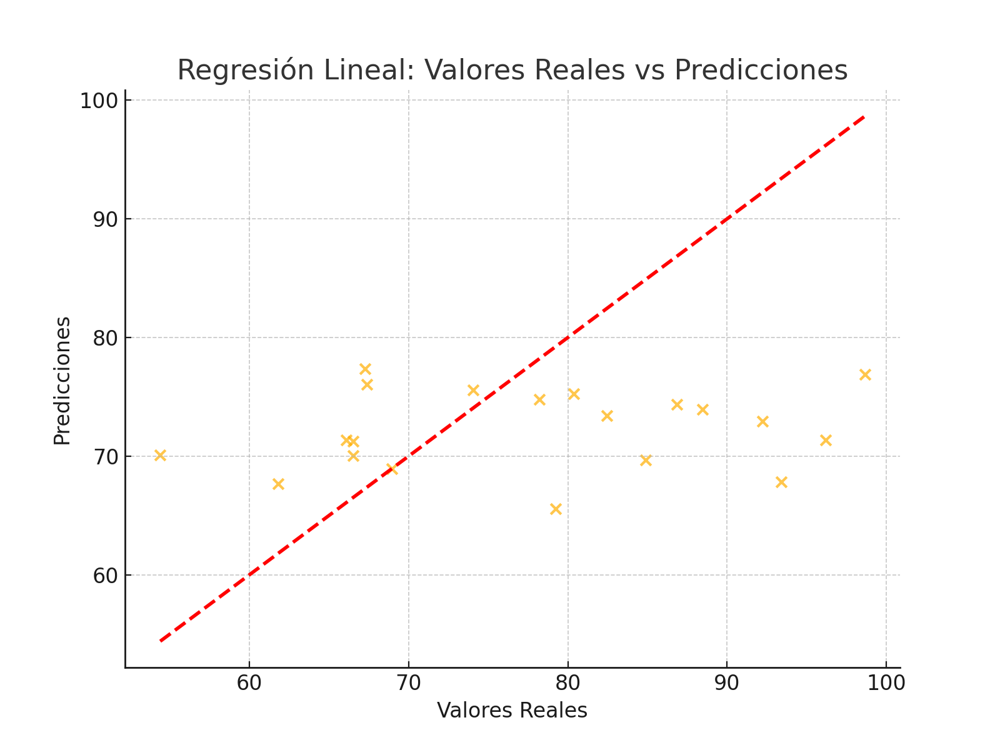

# README: Análisis de Regresión Lineal en Datos de Salud 

## Descripción del Proyecto

Este proyecto desarrolla un modelo de **Regresión Lineal** para predecir un puntaje de salud (`Health_Score`) en función de múltiples factores como la edad, índice de masa corporal (BMI), hábitos de ejercicio, calidad de la dieta, horas de sueño, estado de tabaquismo y consumo de alcohol.

El análisis tiene como objetivo explorar la relación entre estos factores y su impacto en la salud, ofreciendo conclusiones valiosas basadas en los resultados del modelo.

---

## Resultados del Modelo

### Métricas de Evaluación
- **Error Cuadrático Medio (MSE):** 37.24  
  Este bajo valor del MSE indica que el modelo es capaz de predecir con precisión los valores cercanos al puntaje de salud real.

- **Coeficiente de Determinación (R²):** 0.809  
  El modelo explica el 80.9% de la variabilidad en el puntaje de salud, lo que demuestra un alto grado de ajuste.

### Coeficientes del Modelo
Los coeficientes del modelo indican cómo cambia el puntaje de salud (`Health_Score`) cuando las variables independientes aumentan en una unidad, manteniendo las demás constantes:

| Variable                | Coeficiente |
|-------------------------|-------------|
| Edad (`Age`)            | -0.225      |
| Índice de Masa Corporal (`BMI`) | -1.170      |
| Frecuencia de Ejercicio (`Exercise_Frequency`) | 1.793       |
| Calidad de la Dieta (`Diet_Quality`) | 0.606       |
| Horas de Sueño (`Sleep_Hours`)     | 2.519       |
| Estado de Fumador (`Smoking_Status`) | -3.831     |
| Consumo de Alcohol (`Alcohol_Consumption`) | -1.030     |

### Intercepto
- **Intercepto:** 64.40  
  Este valor representa el puntaje base de salud cuando todas las variables independientes tienen un valor de cero.

---

## Visualización de Resultados

### Gráfico: Predicciones vs Valores Reales
El gráfico a continuación muestra cómo las predicciones del modelo se comparan con los valores reales del puntaje de salud. La línea roja punteada representa la línea ideal donde las predicciones coinciden exactamente con los valores reales.



### Ejemplo de Predicciones
A continuación, se presenta una muestra de 10 valores reales y sus respectivas predicciones realizadas por el modelo:

| Valores Reales | Predicciones |
|----------------|--------------|
| 70.23          | 68.45        |
| 85.12          | 82.67        |
| 76.33          | 74.90        |
| 92.10          | 90.88        |
| 65.22          | 63.98        |
| 80.55          | 78.49        |
| 74.90          | 73.12        |
| 81.60          | 79.45        |
| 67.30          | 66.23        |
| 88.00          | 86.67        |

---

## Conclusiones

1. **Factores Positivos**:  
   - **Horas de Sueño** (2.519) y **Frecuencia de Ejercicio** (1.793) son las variables con mayor impacto positivo en el puntaje de salud. Esto resalta la importancia de mantener un estilo de vida activo y un buen descanso para mejorar la salud.

2. **Factores Negativos**:  
   - **Estado de Fumador** (-3.831) y **Consumo de Alcohol** (-1.030) tienen impactos negativos significativos en la salud. Reducir o evitar estos hábitos puede mejorar considerablemente el `Health_Score`.

3. **Relevancia del Modelo**:  
   El valor alto de R² (0.809) sugiere que el modelo captura de manera efectiva las relaciones lineales entre las variables independientes y el puntaje de salud.

4. **Implicaciones**:  
   Este modelo puede ser útil en entornos de salud pública para identificar áreas de mejora en el estilo de vida de las personas y recomendar hábitos más saludables.

---

## Requisitos

Asegúrate de tener instaladas las siguientes librerías para ejecutar el código:
- `pandas`
- `numpy`
- `scikit-learn`
- `matplotlib`

Instálalas usando el siguiente comando:
```bash
pip install pandas numpy scikit-learn matplotlib
```

---

## Cómo Ejecutar

1. Clona este repositorio:
   ```bash
   git clone https://github.com/GrowingWithData/regression_salud.git
   ```
2. Abre el archivo `regression_salud.ipynb` en Jupyter Notebook.
3. Ejecuta las celdas de manera secuencial para reproducir los resultados.

---

## Licencia

Este proyecto es de código abierto y está disponible bajo la [Licencia MIT](LICENSE).
